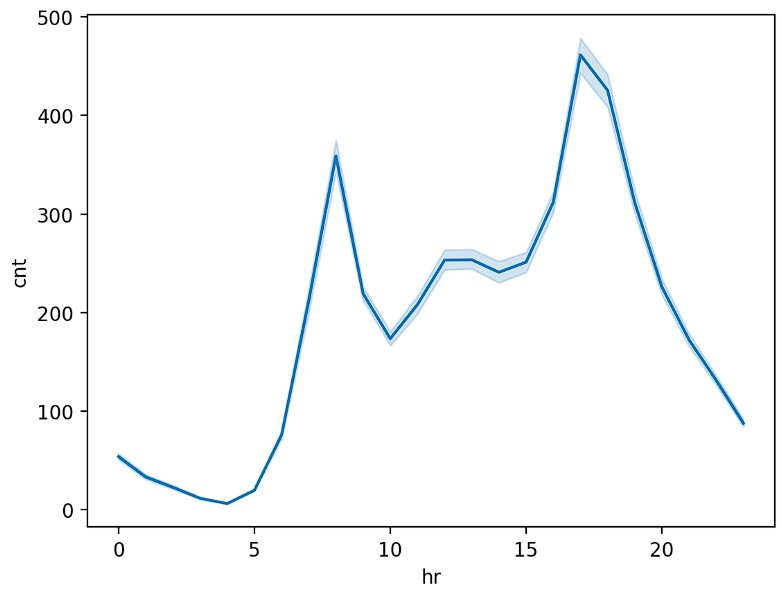
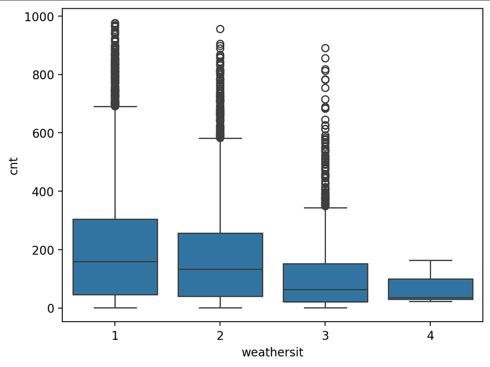

# Bike Sharing Data Analysis

## Deskripsi Proyek

Proyek ini merupakan analisis data end-to-end menggunakan Bike Sharing Dataset untuk memahami pola penggunaan sepeda dan faktor-faktor yang memengaruhi jumlah peminjaman. 
Analisis dilakukan melalui tahapan data wrangling, exploratory data analysis (EDA), visualisasi data, serta analisis lanjutan menggunakan machine learning sederhana sebagai pendukung insight.

## Dataset

Dataset yang digunakan adalah **Bike Sharing Dataset (Capital Bikeshare, 2011–2012)**. Dataset ini berisi data peminjaman sepeda dengan granularitas waktu per jam, termasuk informasi waktu, 
kondisi cuaca, dan jumlah peminjaman sepeda.

File dataset yang digunakan:

* `hour.csv`

## Cara Menjalankan Proyek

### 1. Menjalankan Notebook (Analisis Data)

Pastikan seluruh library yang dibutuhkan telah terinstal.

```bash
pip install -r requirements.txt
```

Buka file `notebook.ipynb` menggunakan Jupyter Notebook atau Google Colab, lalu jalankan seluruh cell secara berurutan.

### 2. Menjalankan Dashboard Streamlit (Local)

Dashboard Streamlit digunakan untuk menyajikan visualisasi utama dan ringkasan insight hasil analisis.

```bash
streamlit run dashboard.py
```

Dashboard akan terbuka melalui browser pada alamat lokal.

## Ringkasan Insight

* Pola penggunaan sepeda menunjukkan dua puncak utama pada jam sibuk pagi dan sore hari, yang mengindikasikan penggunaan sepeda sebagai sarana transportasi komuter.
* Kondisi cuaca berpengaruh terhadap jumlah peminjaman sepeda, di mana cuaca cerah mendorong peningkatan penggunaan dibandingkan kondisi cuaca yang lebih buruk.
* Analisis lanjutan menggunakan regresi linear sederhana menunjukkan bahwa faktor waktu dan cuaca mampu menjelaskan sebagian variasi jumlah peminjaman sepeda, sehingga mendukung insight yang diperoleh dari eksplorasi data.

## Screenshot Dashboard




